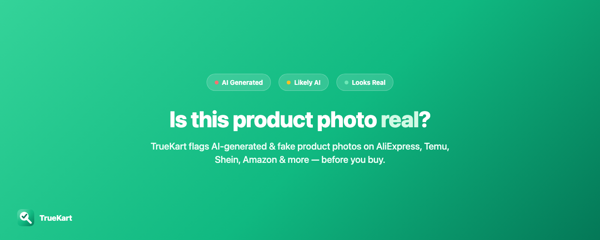
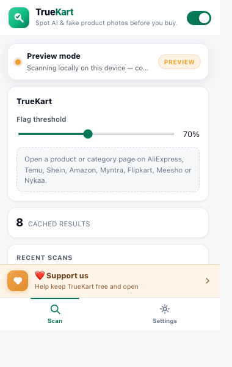
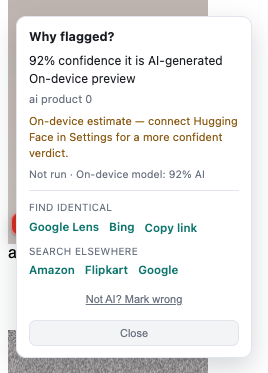
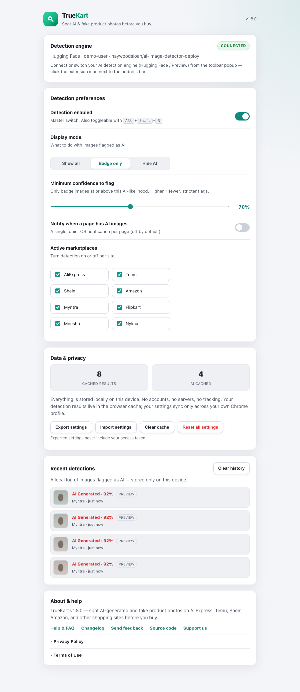
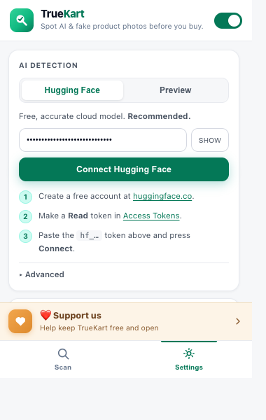

<div align="center">


<h1>TrueKart</h1>

<p><strong>Spot AI-generated and fake product photos — before you buy.</strong></p>

<p>
  <a href="https://github.com/yshraj/ai-product-image-detector/actions/workflows/ci.yml"></a>
  <a href="LICENSE"></a>
  <a href="CHANGELOG.md"></a>
  <a href="CONTRIBUTING.md"></a>
</p>

<p>
  <a href="#install">Install</a> ·
  <a href="#see-it-in-action">Screenshots</a> ·
  <a href="#how-it-works">How it works</a> ·
  <a href="#developer-guide">Developer guide</a> ·
  <a href="#documentation">Docs</a> ·
  <a href="#contributing">Contributing</a>
</p>



</div>

TrueKart is a Chrome extension that checks product photos while you shop. It badges images that look AI-generated or fake directly on the product grid of **AliExpress, Temu, Shein, Amazon, Myntra, Flipkart, Meesho, and Nykaa** — the marketplaces where a listing's "hero" photo is most likely to be synthetic or stolen.

No build step, no backend, no account: Manifest V3 and vanilla JavaScript, running entirely in your browser.

> [!IMPORTANT]
> TrueKart is a **signal, not a verdict**. Detection models are imperfect in both directions, so treat a badge as a reason to look closer — together with reviews, ratings, and common sense. The project publishes real, reproducible accuracy numbers (including the unflattering ones) in [docs/ACCURACY.md](docs/ACCURACY.md).

**Contents:** [Why TrueKart](#why-truekart) · [See it in action](#see-it-in-action) · [Install](#install) · [How it works](#how-it-works) · [Supported marketplaces](#supported-marketplaces) · [Developer guide](#developer-guide) · [Build and release](#build-and-release) · [Security and privacy](#security-and-privacy) · [Troubleshooting](#troubleshooting) · [Documentation](#documentation) · [Contributing](#contributing) · [License](#license)

## Why TrueKart

- **Inline badges while you browse** — flagged images get a red **AI Generated** (≥ 90% confidence) or amber **Likely AI** (70–89%) chip right on the product grid. The confidence floor is adjustable.
- **Three detection engines, your choice** — a free [Hugging Face](https://huggingface.co) model (most accurate, needs a free token), a zero-setup on-device Preview heuristic, and an optional fully local ONNX model where nothing ever leaves your machine ([docs/ONDEVICE.md](docs/ONDEVICE.md)).
- **Every verdict is explained** — the "Why flagged?" popover shows the confidence score, which engine produced it, a per-layer breakdown, and reverse-image-search shortcuts.
- **Whole-page scan and export** — scan every product on the page from the popup, rescan after changes, and export the results.
- **Right-click any image** — **Check this image** in the context menu gives a one-off verdict for any picture on a supported page.
- **Private by design** — no backend, no accounts, no telemetry. Your Hugging Face token syncs only through your own Chrome profile and is never sent to anyone else.
- **Honest about accuracy** — a reproducible benchmark with published methodology and limitations instead of marketing claims ([docs/ACCURACY.md](docs/ACCURACY.md)).

## See it in action

<table>
<tr>
<td width="50%" valign="top">

**Scan tab — zero setup**<br/>
Works immediately with the built-in on-device Preview engine.



</td>
<td width="50%" valign="top">

**"Why flagged?" — full transparency**<br/>
Confidence, engine, and a per-layer breakdown on every flagged image.



</td>
</tr>
</table>

**Options page — every setting, stored locally**



<sub>Screenshots are captured from the real extension against the same offline fixtures the E2E suite uses — run `npm run capture-screenshots` to regenerate them after a UI change.</sub>

## Install

> [!NOTE]
> TrueKart is not yet published on the Chrome Web Store.
> **TODO:** add the Chrome Web Store link here once the listing is live.

Until then, install from source — about two minutes, no build step:

1. Get the code: `git clone https://github.com/yshraj/ai-product-image-detector.git` (or download the ZIP from GitHub and unpack it)
2. Open `chrome://extensions` and enable **Developer mode** (top right)
3. Click **Load unpacked** and select the repository root — the folder containing `manifest.json`
4. Pin TrueKart to the toolbar and visit any [supported marketplace](#supported-marketplaces)

### Recommended: connect Hugging Face

The built-in Preview engine needs zero setup but is a rough heuristic. For meaningful accuracy, connect the free Hugging Face engine — it takes about a minute:

1. Create a free **Read** token at [huggingface.co/settings/tokens](https://huggingface.co/settings/tokens)
2. Open the TrueKart popup → **Settings** tab → paste the token → **Connect**



### Keyboard shortcuts

| Shortcut | Action |
|----------|--------|
| `Alt+Shift+R` | Toggle scanning on or off |
| `Alt+Shift+S` | Scan all products on the current page |

Rebind either shortcut at `chrome://extensions/shortcuts`.

## How it works

```
popup (Scan / Settings) ──messages──▶ service worker ──▶ Hugging Face API / local ONNX
        ▲                                  │  fetches images (CORS bypass + SSRF guard)
        │ stats · rescan                   ▼
content script ── scans the product grid ──▶ detection/pipeline.js ──▶ badges + "Why flagged?"
```

Each image goes through a three-stage pipeline (`detection/pipeline.js`) — the first stage that produces a decisive answer wins:

| Priority | Engine | When it decides |
|----------|--------|-----------------|
| 1 | Hugging Face **or** on-device ONNX | Whichever engine you selected — authoritative ([docs/ONDEVICE.md](docs/ONDEVICE.md)) |
| 2 | EXIF metadata | Camera EXIF present → decisive "real" |
| 3 | Canvas heuristic | Preview fallback when no engine is connected; results are tagged `preview` |

**Badge tiers:** ≥ 90% → red **AI Generated** · 70–89% → amber **Likely AI** · below your confidence floor → no badge.

**How accurate is it?** On the project's small, reproducible benchmark (19 hand-labeled product photos), the Hugging Face engine flagged only genuine AI images (3 of 3 flags correct) while catching about half of all AI images — and the zero-setup Preview heuristic caught none at the default threshold. That gap is exactly why the UI nudges you to connect an engine. Methodology, raw numbers, and limitations: [docs/ACCURACY.md](docs/ACCURACY.md).

Deeper reading: module map, message protocol, and storage model in [docs/ARCHITECTURE.md](docs/ARCHITECTURE.md) · design rationale in [docs/DESIGN-DECISIONS.md](docs/DESIGN-DECISIONS.md).

## Supported marketplaces

| Marketplace | Domains |
|-------------|---------|
| AliExpress | aliexpress.com, aliexpress.us |
| Temu | temu.com |
| Shein | shein.com, sheinindia.in |
| Amazon | amazon.com, .co.uk, .de, .in, .ca, .com.au, .fr, .it, .es, .co.jp |
| Myntra | myntra.com |
| Flipkart | flipkart.com |
| Meesho | meesho.com |
| Nykaa | nykaa.com |

Each marketplace is one small selector file under `content/sites/`. Adding or fixing a marketplace is the most common contribution and needs no machine-learning background — see [docs/SELECTORS.md](docs/SELECTORS.md) and [Contributing](#contributing).

---

## Developer guide

### Prerequisites

| Requirement | Version | Notes |
|-------------|---------|-------|
| Node.js | 22+ | Matches CI and `.nvmrc` |
| npm | 9+ | Ships with Node |
| Google Chrome | Recent stable | For the unpacked extension and E2E tests |

### Set up

```bash
git clone https://github.com/yshraj/ai-product-image-detector.git
cd ai-product-image-detector
npm ci                                         # dev tooling only — the extension has zero runtime dependencies
npx playwright install --with-deps chromium    # one-time setup for the E2E suite
```

`npm ci` installs development tooling (Playwright, axe-core, ESLint, web-ext). The extension itself runs straight from the source files in the repository root.

### Run and develop

```bash
npm start    # web-ext opens Chromium with the extension loaded and reloads on file changes
```

Or load it manually via `chrome://extensions` → **Load unpacked** (see [Install](#install)); after editing content scripts or the service worker, click the reload icon on `chrome://extensions`.

The everyday loop:

1. Edit source files directly — there is no compile step.
2. Reload the extension (automatic under `npm start`).
3. Before pushing: `npm run lint && npm run test:unit && npm test`.
4. Smoke-test on a real marketplace page.

### Test

```bash
npm run validate      # manifest + file refs + JS syntax + version sync + no debugger
npm run eslint        # ESLint (flat config)
npm run lint          # ESLint + validate
npm run test:unit     # Node unit tests
npm test              # Playwright E2E tests (offline mocks); alias: npm run test:e2e
npm run test:headed   # E2E with a visible browser
npm run test:report   # open the HTML report after a failed run
```

| Suite | Scope |
|-------|-------|
| **Unit** | Defaults, cache, marketplace-URL guards, on-device config + SHA-256, service-worker SSRF guard + Hugging Face response parsing, strings |
| **E2E** | Extension load, popup, options, scanning, badges, "Why flagged?", export, history, SPA re-scan, permissions, storage, accessibility — fully offline |

E2E tests load the **real unpacked extension** in Chromium; marketplace pages and Hugging Face are mocked offline, so no API keys are needed. Test architecture: [test/e2e/README.md](test/e2e/README.md).

**CI** ([.github/workflows/ci.yml](.github/workflows/ci.yml)) runs on every push to `main` and every pull request: `npm ci` → ESLint → validate → unit tests → Playwright install → E2E tests, with screenshots and reports uploaded on failure.

### Debug

| Context | How |
|---------|-----|
| Content script | DevTools on the marketplace tab → Console, filter `[RMF]` |
| Service worker | `chrome://extensions` → TrueKart → **Service worker** link |
| Popup | Right-click the popup → Inspect |
| Verbose logs | In the marketplace tab console: `localStorage.RMF_DEBUG = '1'`, then reload |

Debug logging is gated in `utils/logger.js` — production users see no `info`/`warn`/`debug` output unless they opt in. (The `RMF` prefix is a holdover from the project's former name, RealModel Filter.)

<details>
<summary><strong>Project structure</strong></summary>

```
manifest.json                  MV3 manifest — permissions, content scripts, CSP
background/service-worker.js   detection calls, badge state, history, image fetch (SSRF-guarded)
content/
  content.js                   scan orchestration, badge rendering, popup messaging
  check-image.js               context-menu "Check this image"
  sites/*.js                   one DOM-selector file per marketplace
detection/
  pipeline.js                  engine priority: remote → EXIF → heuristic
  remote.js · exif-check.js · tfjs-detector.js
  ondevice/                    opt-in local ONNX engine (download, cache, inference)
offscreen/                     offscreen document hosting the ONNX Runtime session
popup/                         two-tab popup UI (Scan / Settings)
options/                       full settings page
utils/                         defaults, cache, logger, strings, throttle, …
libs/exifr.min.js              vendored EXIF parser (see THIRD-PARTY-NOTICES.md)
icons/ · logos/ · docs/        assets and documentation
scripts/                       validation, screenshot capture, asset generation
test/unit · test/e2e           Node unit tests · Playwright E2E suite
web-ext-config.mjs             files excluded from the store zip
```

</details>

<details>
<summary><strong>Less common workflows</strong></summary>

- **A marketplace redesign broke the badges** — update the selectors in `content/sites/<site>.js`; see [docs/SELECTORS.md](docs/SELECTORS.md) and [docs/ARCHITECTURE.md](docs/ARCHITECTURE.md#content-script-content).
- **Refresh the vendored EXIF library** — `npm run refresh-exifr` (version-pinned, re-attaches the required license banner).
- **Regenerate the README/docs screenshots** — `npm run capture-screenshots` writes `docs/screenshots/*.png` from the offline E2E fixtures; no live sites involved.

</details>

## Build and release

```bash
npm run build
```

Produces `dist/truekart_ai_fake_photo_check-<version>.zip` (~120 KB). `web-ext-config.mjs` keeps development files (tests, docs, `node_modules/`) out of the package, and the optional on-device ONNX runtime (`libs/onnx/`, `offscreen/`) is excluded from the default lean build — see [docs/ONDEVICE.md](docs/ONDEVICE.md).

Before tagging a release:

```bash
npm ci && npm run lint && npm run test:unit && npm test && npm run build
```

Bump the version in **both** `package.json` and `manifest.json` — `npm run validate` fails if they diverge. Store upload steps, listing copy, and per-permission justifications live in [CHROMEWEBSTORE.md](CHROMEWEBSTORE.md).

## Security and privacy

- **No backend, no telemetry, no accounts.** The only outbound requests are Hugging Face inference (if you connect it), marketplace image CDNs, and — only if you enable the on-device engine — the model-weights URL you configure.
- **Least-privilege permissions:** `activeTab`, `storage`, `scripting`, `tabs`, `notifications`, `contextMenus`, with host permissions scoped per marketplace. Threat model: [SECURITY.md](SECURITY.md) · per-permission rationale: [CHROMEWEBSTORE.md](CHROMEWEBSTORE.md).
- **Your Hugging Face token** lives in `chrome.storage.sync` (your own Chrome profile), is never sent anywhere except Hugging Face, and is always excluded from settings export.
- **Hardening:** image fetches in the service worker pass an SSRF guard; on-device model URLs must be `https`; extension pages run under CSP `script-src 'self' 'wasm-unsafe-eval'`.
- **Found a vulnerability?** Please report it privately via [SECURITY.md](SECURITY.md) — not in a public issue.

In-app legal text: [docs/PRIVACY.md](docs/PRIVACY.md) · [docs/TERMS.md](docs/TERMS.md)

## Troubleshooting

| Symptom | Fix |
|---------|-----|
| No badges on a site | The site's DOM changed — update `content/sites/<site>.js` ([docs/SELECTORS.md](docs/SELECTORS.md)) |
| Popup says "unsupported" | Switch to a tab on a [supported marketplace](#supported-marketplaces) |
| Hugging Face "warming up" | Model cold start — wait ~20 s and rescan |
| Token rejected | Create a fresh **Read** token at huggingface.co/settings/tokens |
| Stale badges after changing engines | **Clear cache** in Settings |
| E2E tests fail locally | Run `npx playwright install --with-deps chromium` |
| `validate` complains about versions | Sync `version` in `package.json` and `manifest.json` |

---

## Documentation

| Document | What it covers |
|----------|----------------|
| [FEATURES.md](FEATURES.md) | Quick reference for the popup tabs and their logic |
| [docs/ACCURACY.md](docs/ACCURACY.md) | Real, reproducible detection-accuracy numbers and methodology |
| [docs/ROADMAP.md](docs/ROADMAP.md) | Current state and near-term plans |
| [CHANGELOG.md](CHANGELOG.md) | Version history (Keep a Changelog format) |
| [docs/ARCHITECTURE.md](docs/ARCHITECTURE.md) | Module map, message protocol, detection pipeline, storage model |
| [docs/DESIGN-DECISIONS.md](docs/DESIGN-DECISIONS.md) | Why vanilla JS, why detection runs in the worker, and more |
| [docs/ONDEVICE.md](docs/ONDEVICE.md) | The opt-in local ONNX engine: architecture, activation, validation |
| [docs/SELECTORS.md](docs/SELECTORS.md) | Per-marketplace selector contract and live verification protocol |
| [test/e2e/README.md](test/e2e/README.md) | Playwright test architecture |
| [SECURITY.md](SECURITY.md) | Threat model and vulnerability disclosure |
| [docs/PRIVACY.md](docs/PRIVACY.md) · [docs/TERMS.md](docs/TERMS.md) | In-app legal text |
| [THIRD-PARTY-NOTICES.md](THIRD-PARTY-NOTICES.md) | Licenses of redistributed third-party components |
| [CHROMEWEBSTORE.md](CHROMEWEBSTORE.md) | Store listing copy and per-permission justifications |
| [docs/STORE-ASSETS.md](docs/STORE-ASSETS.md) | Chrome Web Store asset specs |
| [docs/archive/](docs/archive/) | Historical audits from earlier versions (not current) |

## Contributing

Contributions are welcome — [CONTRIBUTING.md](CONTRIBUTING.md) covers setup, code conventions, and the pull-request checklist. All participation falls under the [Code of Conduct](CODE_OF_CONDUCT.md).

- **The easiest way in:** issues labeled [`good first issue`](https://github.com/yshraj/ai-product-image-detector/issues?q=is%3Aissue+is%3Aopen+label%3A%22good+first+issue%22). Verifying and fixing a marketplace's selectors needs no machine-learning background — just a browser and a real shopping page.
- **Bugs and feature ideas:** open an [issue](https://github.com/yshraj/ai-product-image-detector/issues) — templates are provided.
- **Planned work:** see [docs/ROADMAP.md](docs/ROADMAP.md) before starting anything large.
- **Security reports:** privately via [SECURITY.md](SECURITY.md), never a public issue.
- **Support the project:** the **Sponsor** button on the repository page.

**TODO:** enable GitHub Discussions (repo Settings → Features) and link it here as the home for questions and ideas.

## License

TrueKart is released under the [MIT License](LICENSE) — free to use, modify, distribute, and sell, including commercially, with attribution.

There is **no CLA and no copyright assignment**: contributors keep the copyright to their work, and by contributing you agree it ships under the same MIT terms ([CONTRIBUTING.md](CONTRIBUTING.md#license)). Redistributed third-party components are listed in [THIRD-PARTY-NOTICES.md](THIRD-PARTY-NOTICES.md).

---

<div align="center">
<sub>Formerly <strong>ShopShield</strong> / <strong>RealModel Filter</strong> — the <code>RMF</code> prefix survives in debug logs and storage keys.</sub><br/>
<sub><a href="#truekart">Back to top ↑</a></sub>
</div>
